# Flyway Demo

[Flyway](https://documentation.red-gate.com/fd) is an industry leading database versioning framework that aims to unlock DevOps for the database. It strongly favors simplicity and convention over configuration.

For this demo to run, you should run all commands through a **MS DOS Command Window** or **Windows Powershell**

## Prerequisites

### Install MySql
Install your favorite database tool.  For this demo we'll be using MySQL

Download the community edition of MySQL by selecing MySQL Installer for Windows on this [page](https://dev.mysql.com/downloads/). 

NOTE: You can install the 5.5M as it will download what you need.

Run the installer and select Custom for the Database install option.
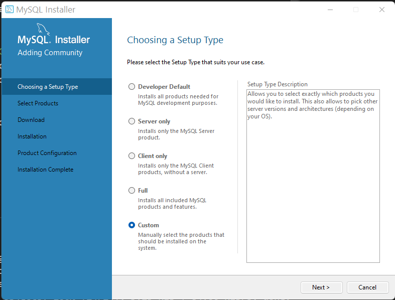

Select just the products we need here.  
* MySQL Server for the database
* MySQL Workbench so we can view the tables and run selects
* The connectors that we need.  Here we're installing .NET, Java (i.e. Connector/J), and Python.  Flyway will need Java.

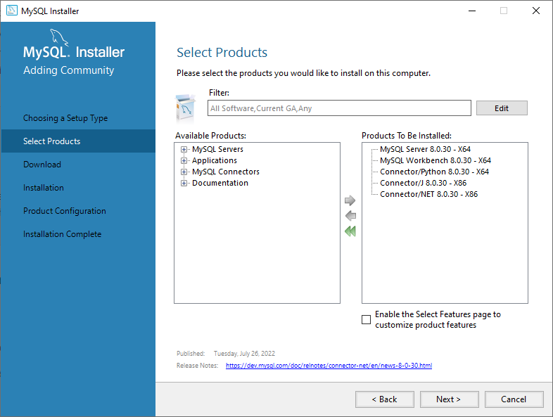


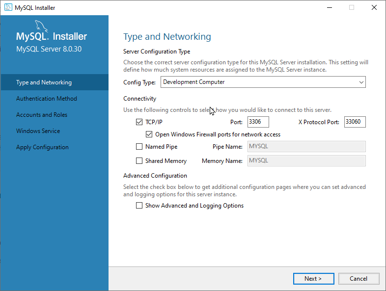

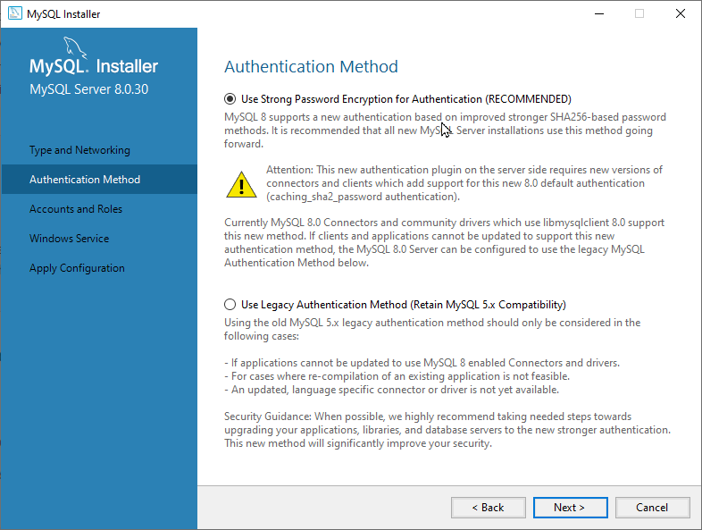

You'll want to add a user `flyway` so that you can add tables and such.  Also setup the MySQL Root Password.

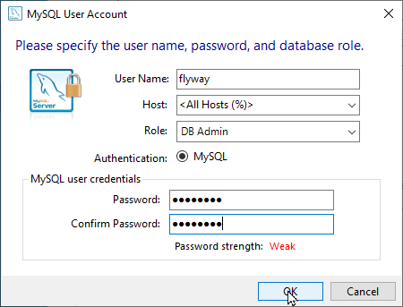

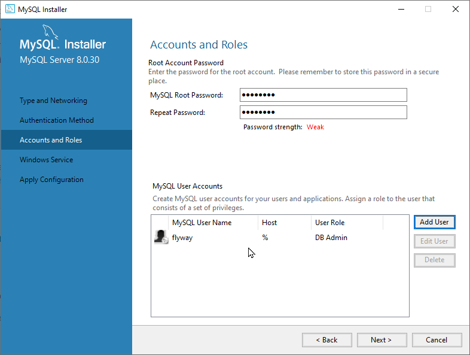

If you chose not to install as a Windows Service (which you probably don't want one) then just remember that you will need to start and start MySQL on your workstation.

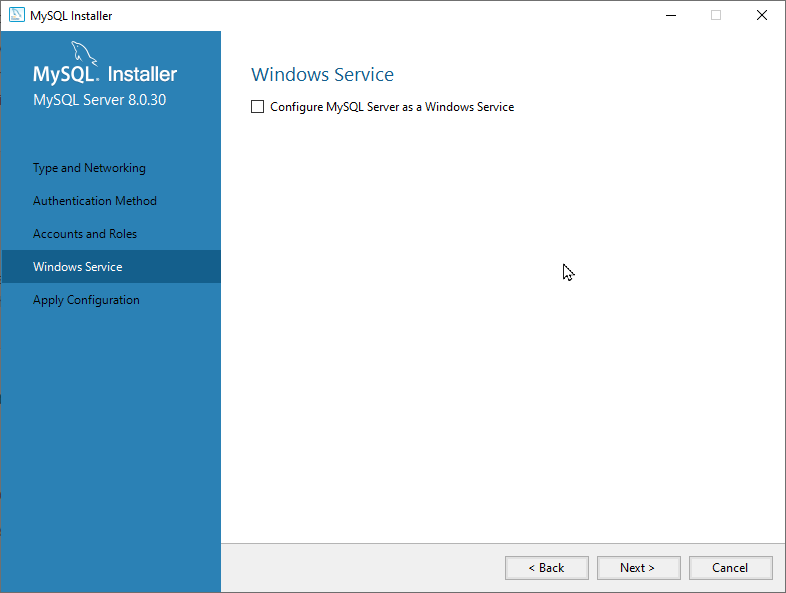

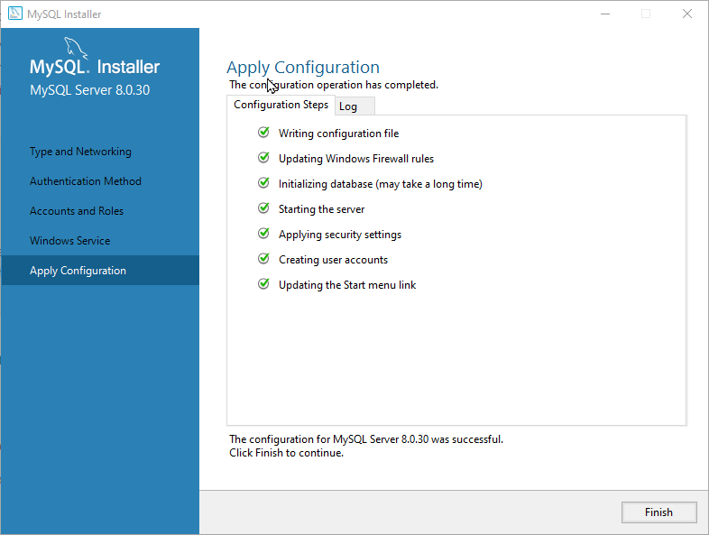

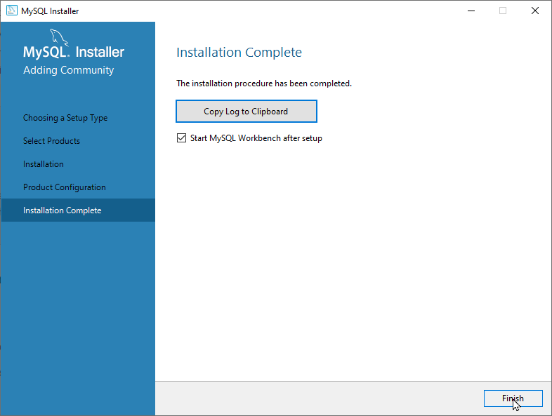

With everything setup, you can choose to Start MySQL Workbench.  From here you'll want to setup a new MySQL Connection to your database from the Workbench.

Select the `+` next to the MySQL Connections to setup a new connection.

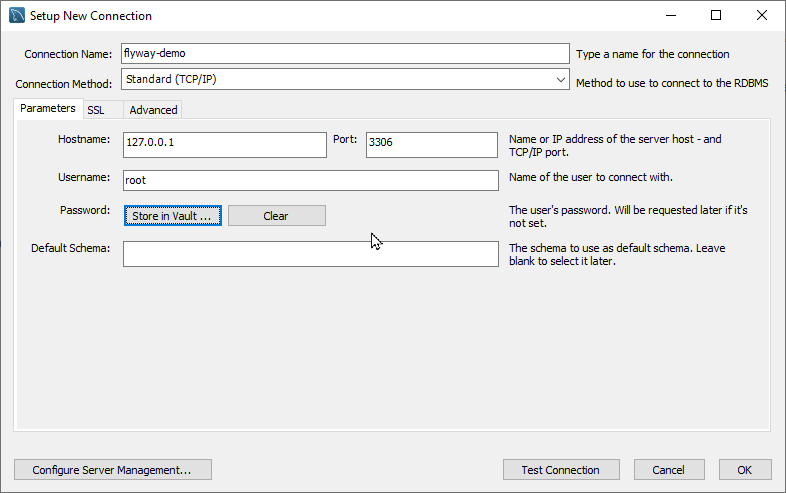

Test the connection.

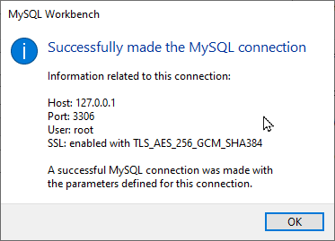

Then you'll see that its setup correctly.

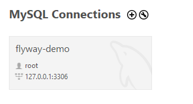

With your database now setup we can begin to add a schema, tables and data through Flyway.

### Install Flyway

Download [Flyway](https://flywaydb.org/documentation/usage/commandline/#download-and-installation) for your target operating system and unzip the files to a directory of your choosing.

#### flyway.conf

In the installation directory there is a flyway.conf file that has all the possible configuration options.  This demo uses a custom configuration file located at `./conf/flyway.conf` to connect to the MySQL database that we just setup.

This file stores your connetion string, user_id and password to connect to the database.  You may need to make changes here.

## Running Flyway

This demo has a Windows command file `run_flyway.cmd` that does some of the heavy liftying for you.  You will need to review this file and change the `FLYWAY_HOME` to the location of where you unzip Flyway.

```
set FLYWAY_HOME=I:\desktop-setup\test\DevTools\flyway-9.4.0
```

There are a few commands that we'll run in this demo.

| Command | Description |
| ------- | ----------- |
| baseline | Baselines an existing database |
| info | Prints the details and status information about all the migrations. |
| migrate | Migrates the schema to the latest version. Flyway will create the schema history table automatically if it doesn’t exist. Open a DOS Command Window or Windows Powershell and invoke the following command to test your connection.
| clean | Drops all objects (tables, views, procedures, triggers, …) in the configured schemas.<br>The schemas are cleaned in the order specified by the schemas and defaultSchema property. |

First run flyway with `baseline` to create the flyway history table

```
> run_flyway.cmd baseline
Flyway is up to date
Flyway Community Edition 9.4.0 by Redgate
See what's new here: https://flywaydb.org/documentation/learnmore/releaseNotes#9.4.0

Database: jdbc:mysql://127.0.0.1:3306/sys (MySQL 8.0)
Creating Schema History table `cis264`.`flyway_schema_history` with baseline ...
Successfully baselined schema with version: 1
```

You can now see that a flyway_schema_history table has been created and our basline is in there.  Our database is now at version 1


Now run an `info` to see what we will migrate.

```
> run_flyway.cmd info
Flyway is up to date
Flyway Community Edition 9.4.0 by Redgate
See what's new here: https://flywaydb.org/documentation/learnmore/releaseNotes#9.4.0

Database: jdbc:mysql://127.0.0.1:3306/sys (MySQL 8.0)
Schema version: 1

+-----------+---------+----------------------------+----------+---------------------+--------------------+
| Category  | Version | Description                | Type     | Installed On        | State              |
+-----------+---------+----------------------------+----------+---------------------+--------------------+
|           | 1       | << Flyway Baseline >>      | BASELINE | 2022-10-06 20:46:58 | Baseline           |
| Versioned | 1.0     | create schema              | SQL      |                     | Ignored (Baseline) |
| Versioned | 1.1     | create customer table copy | SQL      |                     | Pending            |
| Versioned | 1.1.1   | insert customer data       | SQL      |                     | Pending            |
+-----------+---------+----------------------------+----------+---------------------+--------------------+
```

This shows what will be migrated when we run `migrate`.

When Flyway runs `migrate` it will take all the SQL files in the `./sql` directory and apply them to the database.

## The SQL

### V1.1__create_schema.sql

```
CREATE SCHEMA `flyway-demo` ;
```

### V1.2__create_customer_table.sql

```
CREATE TABLE customer (
    id int NOT NULL,
    first_name  varchar(35) NOT NULL,
    last_name   varchar(35) NOT NULL,
    city        varchar(50),
    state       varchar(2),
    zip         INT,
    PRIMARY KEY (id)
);
```

### V1.1.2__insert_customer_data.sql

```
INSERT INTO customer (id, first_name, last_name, city, state, zip) 
    VALUES (1, 'Joe', 'Smith', 'Nowhere', 'MO', 12345);
INSERT INTO customer (id, first_name, last_name, city, state, zip) 
    VALUES (2, 'Jane', 'Doe', 'Tightwad', 'MO', 54321);

```

Now run migrate

```
> run_flyway.cmd migrate
Flyway is up to date
Flyway Community Edition 9.4.0 by Redgate
See what's new here: https://flywaydb.org/documentation/learnmore/releaseNotes#9.4.0

Database: jdbc:mysql://127.0.0.1:3306/sys (MySQL 8.0)
Successfully validated 4 migrations (execution time 00:00.026s)
Current version of schema `cis264`: 1
Migrating schema `cis264` to version "1.1 - create schema"
WARNING: DB: Can't create database 'flyway-demo'; database exists (SQL State:  - Error Code: 1007)
Migrating schema `cis264` to version "1.2 - create customer table copy"
Migrating schema `cis264` to version "1.2.1 - insert customer data"
Successfully applied 3 migrations to schema `cis264`, now at version v1.2.1 (execution time 00:00.124s)
```

Now you can look at MySQL Workbench to see the rows in the table.

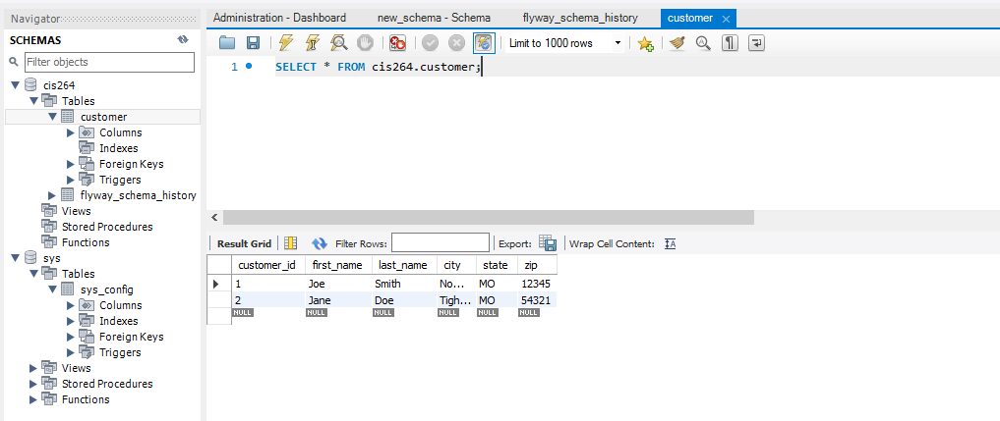

## Conclusion
So just by adding some versioning files you can easily create tables and the rows for your database.

If you really want to start clean each time, you can stack the commands like the following.

```
> run_flyway.cmd clean baseline info migrate
```

When all the versioned files have been applied then you can run an `info` to see the version of the database that you are on.

```
> run_flyway.cmd info

+-----------+---------+----------------------------+----------+---------------------+----------+
| Category  | Version | Description                | Type     | Installed On        | State    |
+-----------+---------+----------------------------+----------+---------------------+----------+
|           | 1       | << Flyway Baseline >>      | BASELINE | 2022-10-06 21:01:07 | Baseline |
| Versioned | 1.1     | create schema              | SQL      | 2022-10-06 21:01:07 | Success  |
| Versioned | 1.2     | create customer table copy | SQL      | 2022-10-06 21:01:07 | Success  |
| Versioned | 1.2.1   | insert customer data       | SQL      | 2022-10-06 21:01:07 | Success  |
+-----------+---------+----------------------------+----------+---------------------+----------+
```


